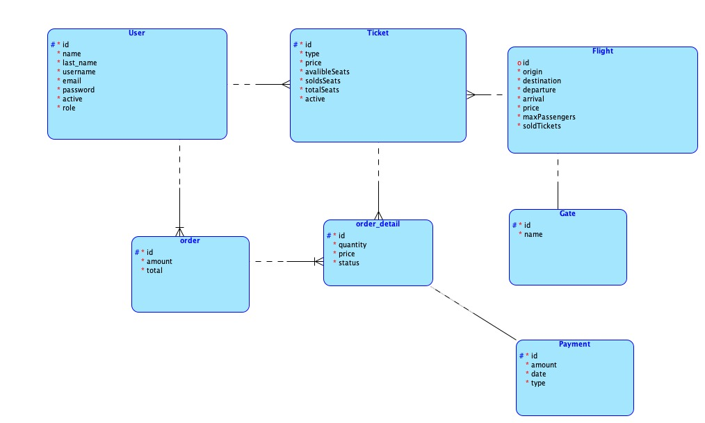
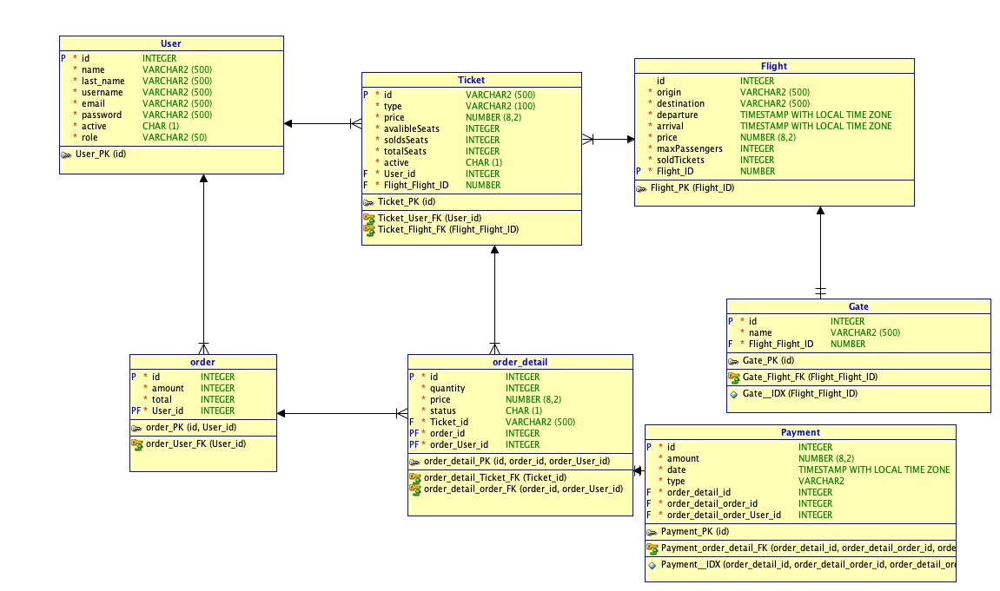
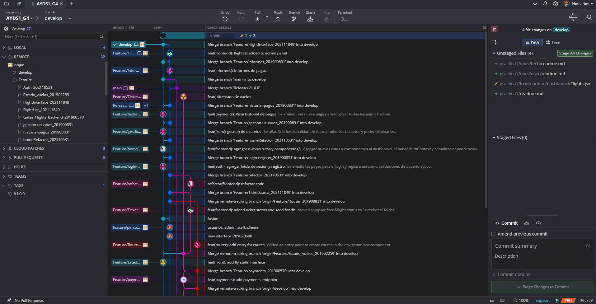

# Práctica 1

## Manual Técnico

Este documento describe la arquitectura, configuración e implementación del sistema de gestión de un aeropuerto. El objetivo es proporcionar una referencia técnica detallada para desarrolladores, administradores de sistemas y cualquier persona involucrada en el mantenimiento del sistema.

La aplicación está desarrollada utilizando NestJS para el backend, React (Vite Framework) para el frontend, y PostgreSQL con Prisma como base de datos. Además,El sistema está diseñado para ser ejecutado en un entorno Dockerizado con GitFlow como modelo de control de versiones.

### Arquitectura del Proyecto
El sistema sigue una arquitectura cliente-servidor con los siguientes componentes:

#### Backend

- Framework: NestJS (arquitectura modular con inyección de dependencias)
- Base de Datos: PostgreSQL (gestionada con Prisma ORM)
- Autenticación: JWT con Passport.js
- Contenedores: Docker y Docker Compose
- Manejo de errores: Excepciones personalizadas con HttpException
- Versionado: Git con GitFlow
- Módulos principales:
    - Autenticación (manejo de usuarios y roles)
    - Gestión de vuelos (registro y modificación de vuelos)
    - Gestión de puertas de embarque (asignación de puertas a vuelos)
    - Gestión de boletos (compra y administración de tickets)
    - Gestión de pagos (procesamiento de pagos y reportes)

#### Frontend
- Framework: React con Vite
- Estado global: Redux Toolkit
- Estilos: CSS + Quasar Framework
- Rutas y navegación: React Router
- Consumo de API: Axios
- Servicios externos:
    - Autenticación (JWT)
    - Manejo de usuarios
    - Gestión de pagos y reportes

### Instalación y Configuración

#### Requisitos Previos
Antes de ejecutar el sistema, asegúrate de tener instalados los siguientes paquetes y herramientas:

- Node.js (v18 o superior)
- Docker y Docker Compose
- PostgreSQL
- Yarn o npm

#### Configuración del proyecto
1. Clonar el repositorio desde GitHub
```bash
git clone < enlace del repositorio >
```

2. Instalar las dependencias de cada módulo
```bash
cd backend
npm install
yarn install
```
```bash
cd frontend
npm install
yarn install
```

3. Ejecutar el dockerizado del proyecto dentro de 'practica1'
```bash
docker compose down
docker compose build
docker compose up
```
4. Acceder al Shell del backend y levantar la base de datos
```bash
npx prisma migrate dev
npx prisma generate
npx prisma studio
```

### Estructura del Proyecto
El sistema de gestión de aeropuerto está diseñado siguiendo una arquitectura modular que separa el backend y el frontend en proyectos independientes. Esto permite una mayor escalabilidad, mantenibilidad y facilidad de desarrollo. A continuación, se describe la estructura de cada componente.

#### Backend
El backend de la aplicación está desarrollado utilizando NestJS, un framework basado en Node.js que sigue el patrón modular y orientado a servicios, facilitando la organización y escalabilidad del código. Se integra con Prisma ORM para la gestión de la base de datos PostgreSQL, permitiendo la manipulación de datos de manera segura y eficiente.

La estructura del backend sigue una organización por módulos, donde cada entidad del sistema tiene su propio directorio con sus respectivas configuraciones.
```
backend/
├── prisma/              # Configuración de Prisma ORM
│   ├── migrations/      # Migraciones de la base de datos
│   ├── schema.prisma    # Esquema de la base de datos
│   ├── seed.ts          # Datos iniciales
│
├── src/                 # Código fuente del backend
│   ├── auth/            # Módulo de autenticación
│   ├── flights/         # Módulo de gestión de vuelos
│   ├── gates/           # Módulo de puertas de embarque
│   ├── payments/        # Módulo de pagos
│   ├── ticket/          # Módulo de boletos
│   ├── app.module.ts    # Módulo principal de NestJS
│   ├── main.ts          # Punto de entrada
│
├── Dockerfile           # Configuración de Docker
├── package.json         # Dependencias del backend
├── tsconfig.json        # Configuración de TypeScript
```

La carpeta prisma/ contiene la configuración del esquema de la base de datos, las migraciones y el script de inicialización (seed.ts), lo que facilita la replicación del entorno, si se llegara a necesitar.

Finalmente, el backend está completamente dockerizado, lo que permite su despliegue en cualquier entorno sin complicaciones.

#### Base de Datos
El sistema de gestión de aeropuerto utiliza PostgreSQL como base de datos relacional, permitiendo almacenar y gestionar información estructurada de manera eficiente. La comunicación con la base de datos se realiza a través de Prisma ORM, lo que facilita la manipulación de datos mediante consultas SQL optimizadas y migraciones controladas.

El diseño de la base de datos sigue un modelo relacional, donde las entidades están normalizadas para evitar redundancia y mejorar la integridad de los datos. Se han implementado índices y claves foráneas para optimizar el rendimiento en consultas frecuentes y garantizar la consistencia referencial.

##### Estructura de la Base de Datos
La base de datos está compuesta por las siguientes tablas principales:

| Tabla        | Descripción                                      |
|--------------|--------------------------------------------------|
| Users        | Usuarios del sistema con roles y credenciales   |
| Flights      | Información de vuelos programados               |
| Gates        | Puertas de embarque disponibles                 |
| Tickets      | Boletos de pasajeros para vuelos                |
| Payments     | Registros de pagos realizados                   |

Cada tabla incluye restricciones de integridad referencial, validaciones y relaciones con otras tablas para garantizar la coherencia de los datos.

##### Diagrama Lógico
El diagrama lógico de la base de datos muestra las tablas principales y sus relaciones:


##### Diagrama Físico
El diagrama físico de la base de datos muestra la estructura de las tablas y sus columnas:


#### Frontend
El frontend está desarrollado con React.js y utiliza Vite como herramienta de construcción para mejorar el rendimiento y la experiencia de desarrollo.

La gestión del estado global se maneja con Redux Toolkit, lo que permite un control eficiente de los datos compartidos en la aplicación. Además, se utiliza la librería MUI Materials para proporcionar una interfaz de usuario moderna y responsiva.
```
frontend/
├── src/                 # Código fuente
│   ├── api/             # Servicios API
│   ├── auth/            # Módulo de autenticación
│   ├── components/      # Componentes reutilizables
│   ├── dashboard/       # Panel de usuario y administrador
│   ├── hooks/           # Hooks personalizados
│   ├── interfaces/      # Definiciones de tipos
│   ├── router/          # Configuración de rutas
│   ├── service/         # Servicios de usuario y pagos
│   ├── store/           # Estado global con Redux Toolkit
│   ├── App.jsx          # Componente principal
│
├── Dockerfile           # Configuración de Docker
├── package.json         # Dependencias del frontend
├── vite.config.js       # Configuración de Vite
```

El frontend también está dockerizado, lo que permite su despliegue en servicios en la nube como Vercel, Cloud Run o AWS. Gracias a esta estructura modular, la aplicación es fácil de mantener y extender en futuras iteraciones.

#### Documentación
```
docs/
├── tech/                # Manual técnico
|   ├── images/          # Imágenes del manual
│   ├── readme.md        # Descripción general
│
├── user/                # Manual de usuario
|   ├── images/          # Imágenes del manual
│   ├── readme.md        # Descripción general
```

### Flujo de Desarrollo con GitFlow

Se utiliza GitFlow para la gestión del código:

- main: Código en producción.
- develop: Código en desarrollo.
- feature/: Funcionalidades nuevas.
- release/: Versiones preparadas para producción.
- hotfix/: Correcciones urgentes.

Se utilizó GitKraken para la gestión de ramas y control de versiones.



## API Endpoints
Esta sección refiere a la documentación detallada de los endpoints disponibles en la API del sistema de gestión del aeropuerto, organizados por módulos.

Cada endpoint incluye su método HTTP, la ruta correspondiente y una descripción de su funcionalidad.

Se proporcionan ejemplos de solicitudes y respuestas para facilitar la integración con el sistema. Todos los endpoints que requieren autenticación utilizan JWT (JSON Web Token).

Se recomienza el uso de Postman para la realización de pruebas con la API.

[Endpoints de autenticación](../../backend/Auth-Endpoints.md)
[Endpoints de vuelos y puertas](../../backend/Flights_gates_endpoints.md)
[Endpoints de pagos](../../backend/payments_endpoints.md)
[Endpoints de boletos](../../backend/ticket-endpoint.md)