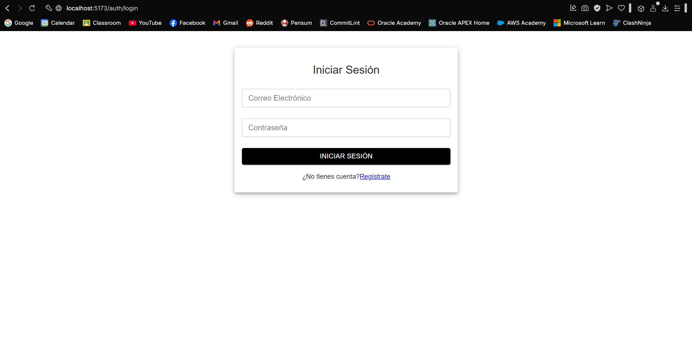
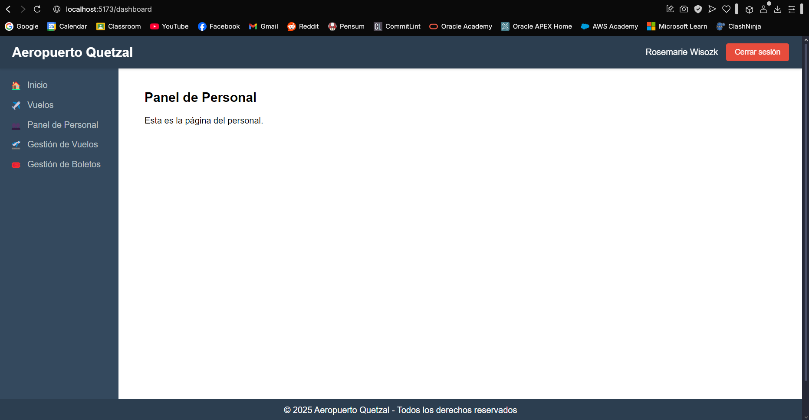
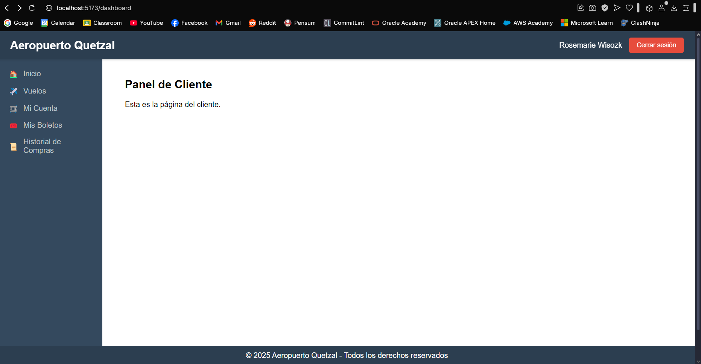

# Práctica 1

## Manual de Usuario

El Sistema de Gestión de Aeropuerto es una plataforma diseñada para facilitar la administración de vuelos, pasajeros, puertas de embarque y boletos. Su objetivo es mejorar la eficiencia operativa de un aeropuerto mediante una interfaz intuitiva y herramientas que permiten el registro, monitoreo y gestión de información clave.

Este manual está diseñado para guiar al usuario en el uso de la plataforma, proporcionando instrucciones detalladas sobre el acceso al sistema, navegación por las distintas funcionalidades y la ejecución de tareas comunes. A lo largo del documento, se explicarán los módulos principales del sistema, los roles de usuario disponibles y los procesos de gestión de vuelos, boletos y pagos.

Se recomienda a los usuarios seguir este manual para garantizar el uso óptimo del sistema y aprovechar todas sus capacidades. En caso de dudas o problemas, se puede contactar al administrador del sistema para recibir asistencia adicional.

### Acceso al Sistema

Para acceder al Sistema de Gestión de Aeropuerto, el usuario debe abrir un navegador web e ingresar la URL proporcionada por el administrador del sistema. Una vez en la página de inicio, el usuario deberá introducir sus credenciales de acceso (nombre de usuario y contraseña) y hacer clic en el botón "Iniciar Sesión".

En caso de que no se tenga una cuenta registrada, puede hacer click en el enlace "Registrarse" para crear una nueva cuenta. El usuario deberá completar el formulario de registro con su información personal y elegir un nombre de usuario y contraseña para acceder al sistema.

Una vez iniciada la sesión, el usuario será redirigido a la interfaz principal del sistema. Dependiendo del rol asignado, el usuario podrá acceder a diferentes secciones y funcionalidades.

### Interfaz de Usuario - Administrador

En el caso de un administrador, la interfaz mostrará un panel de control con los siguientes elementos:

- Vista de todos los vuelos disponibles
- Panel de administración
- Gestión usuarios
- Historial de pagos
- Creación de nuevo usuario.

### Interfaz de Usuario - Empleado

Para un empleado, la interfaz mostrará un panel de control con los siguientes elementos:

- Vista de vuelos
- Panel de Personal
- Gestión de vuelos
- Gestión de boletas

### Interfaz de Usuario - Pasajero

Para un pasajero, la interfaz mostrará un panel de control con los siguientes elementos:

- Vista de vuelos
- Cuenta del usuario
- Boletos del usuario
- Historial de compras

